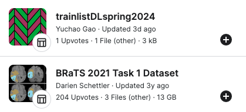
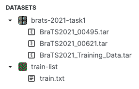

#  CS-GY 6953 DL Spring 2024 Final Project
### Introduction

This is U-Net and Attention U-Net for brain tumor segmentation. 

### Data

This is a `Kaggle` python notebook, all settings are based on `Kaggle` environment. 

Add the following input dataset before you run. Name the train list dataset as 'train-list':



After adding inputs, it will be like this:



Each case includes MRI images in four modalities along with segmentation labels, structured as follows:

```
BraTS2021_00000
├── BraTS2021_00000_flair.nii.gz
├── BraTS2021_00000_seg.nii.gz
├── BraTS2021_00000_t1ce.nii.gz
├── BraTS2021_00000_t1.nii.gz
└── BraTS2021_00000_t2.nii.gz
```

The data consists of four MRI modalities: FLAIR, T1ce, T1, and T2. Each modality has images of size 240 x 240 x 155, and they share the same segmentation labels.

Segmentation Labels: [0, 1, 2, 4]

- Label 0: Background
- Label 1: Necrotic tumor core (NT)
- Label 2: Peritumoral edema (ED)
- Label 4: Enhancing tumor region (ET)

It is recommended to use `3D Slicer` or `ITK-SNAP` to view the images and labels for a visual understanding of the dataset you are working with.

### Outputs

U-Net Results (max_lr=0.004, min_lr=0.002):


A full version of the code you can view by this link: https://www.kaggle.com/code/yucgao/dl-spring2024-final-v2

View the example notebook with full results: https://github.com/gao0122/DL_spring2024_Final_Project/blob/main/dl-spring2024-final-output-example.ipynb

The plot notebook is for plotting by log outputs in case the running notebook is interrupted.
